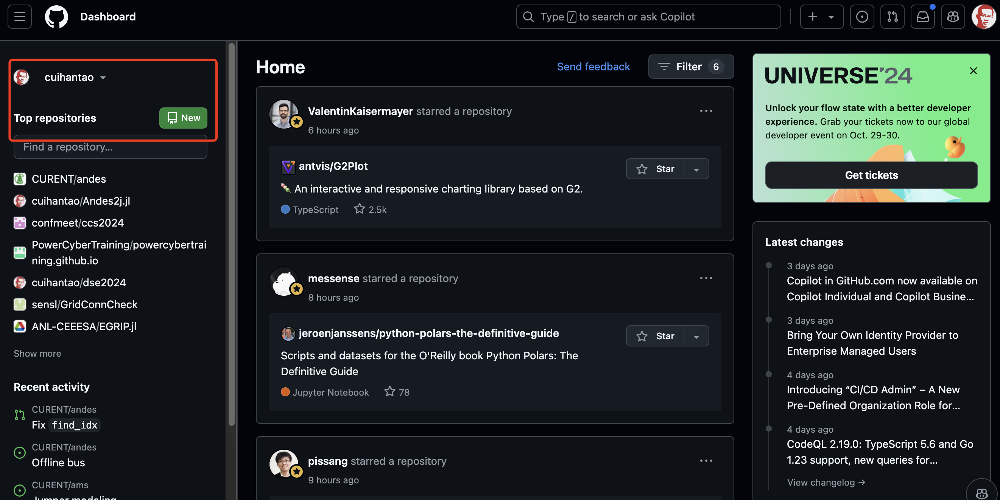
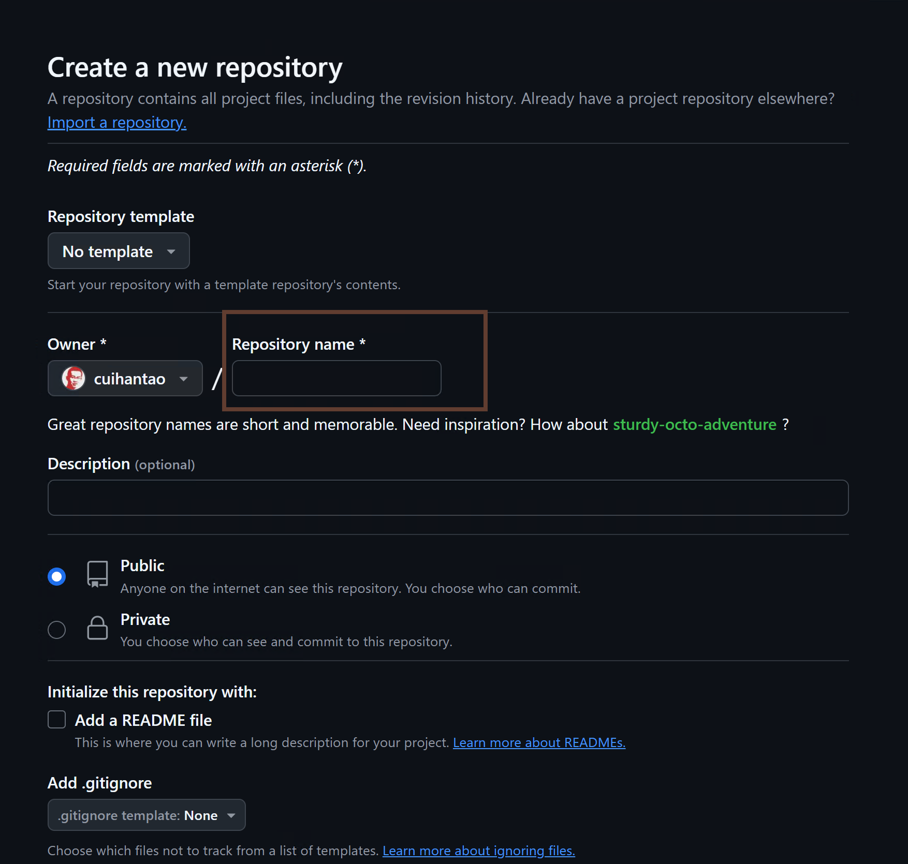
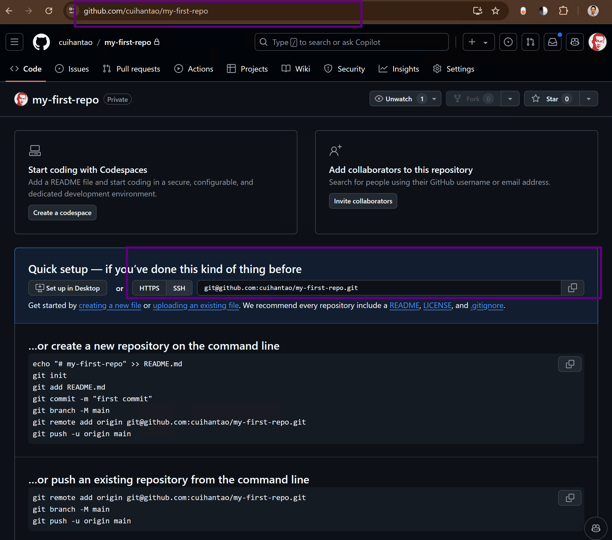

<div class="cell markdown">

# Git and Version Control

## Motivation

Version control systems, particularly Git, are essential tools for
modern power engineers working on complex projects and simulations.

Have you heard of [GitHub.com](https://github.com/)? It is a place where
open-source software projects shared, where researchers can find useful
code from publications, and developers can collaborate without knowing
each other.

Powering GitHub.com is the `git` version control system. Git is
originally developed by Linus Torvalds, the original developer of the
Linux Kernel, for allowing thousands of people to collaborate
efficiently on kernel development. By "version control", it means that
the software code is versioned with the changes tracked. When a version
of code does not work, the version control system allows the developer
to roll back to a previous version. If more than one person working on
the same project, they can make changes simultaneously and then "merge"
the code whenever ready.

So, how is this relevant to power engineers? Even if it is not
immediately useful, it is a good skill to have. For example, if you
found an open-source project on GitHub and want to use it, there are
better ways than downloading the project as a Zip file. Also, if you
wish to publish your code on GitHub, this module may be useful. We want
to provide a walk through so that you know the basic concepts.

## Learn by doing - GitHub

Start by creating a GitHub account at [GitHub.com](https://github.com/).

Below is a screenshot of my dashboard. Yours may look different, but the
layout is always consistent: the left panel is related to your work, the
middle is the feeds from your network, and the right is announcements
and trending projects.



</div>

<div class="cell markdown">

### Repository

</div>

<div class="cell markdown">

A repository (repo) is a storage for a project. It is like a folder for
a project.

Let's start by creating a new repository. Click on the "New" button on
the top-left corner, as shown in the figure above. It will take to the
next page, which looks like this:



</div>

<div class="cell markdown">

Feel free to name it anything, such as `my-first-repo`. You can add a
description but not required. Then, choose if this repo is public
(visible to everyone) or private (visible to you only). For most of our
use cases, we will choose `Public`.

Scroll down to the bottom and click on the green "Create repository"
button. You will be redirected to the repo page.



</div>

<div class="cell markdown">

There are a lot of information to unpack here.

1.  Look at the URL. It is
    `https://github.com/{your_username}/{repo_name}.git`. This is the
    URL you will use to interact with the repo.
2.  In the "Quick setup" section, you can see the address to clone the
    repo.

</div>

<div class="cell markdown">

### Installing Git

Now that you have a repo on GitHub, let's switch to your local machine.
This is where you will do most of your work.

In your WSL, you need to install `git` first. Here, `git` is the
software you will use to interact with the repo.

``` bash
sudo apt-get install git --yes
```

You will be asked to enter your password. When done, you will have the
`git` command available.

For more information, refer to the previous section on package
management.

</div>

<div class="cell markdown">

### Setting up SSH keys

TODO

</div>

<div class="cell markdown">

### Clone the repository

The command to bring the repository to your local machine is called
`clone`.

``` bash
git clone https://github.com/{your_username}/{repo_name}.git
```

This will create a folder called `{repo_name}` in your current
directory, with the repo contents.

</div>

<div class="cell markdown">

### Commit and push changes

</div>

<div class="cell markdown">

### Branch and Remote

</div>

<div class="cell markdown">

### Pull request and merge

### Fork

</div>

<div class="cell markdown">

## Workflow

</div>

<div class="cell markdown">

</div>
