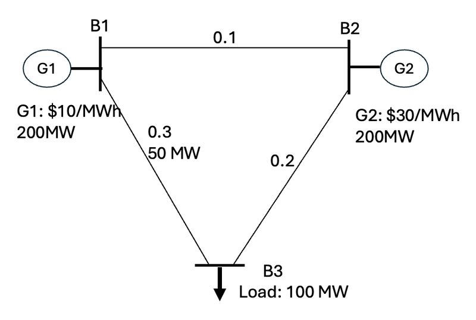

# Why Can LMP at Some Locations Exceed the Most Expensive Unit’s Price?

💡 Ever wondered why electricity prices at some locations spike beyond the cost of the most expensive generator? Even though there is an elegant mathematical explanation for this, a concrete example can provide an intuitive understanding.

Let’s break it down with an intuitive example!

In the U.S. electricity wholesale market, prices at each bus are determined by **Locational Marginal Pricing (LMP)**—the cost of supplying an additional unit of electricity at a specific location. Consumers pay the LMP at their locations. Generators get paid based on the LMP at their connection points.

Under normal conditions, LMP is set by the most expensive unit needed to meet demand. However, when **transmission congestion** occurs, LMP at some locations can exceed even the priciest generator’s cost!

---

## 🔎 A Simple 3-Bus Example: Why Does LMP Spike?


### System Setup

```python
transmission_lines = {
    "B1-B3": {"impedance": 0.3, "limit": 50},  # MW
    "B1-B2": {"impedance": 0.1},
    "B2-B3": {"impedance": 0.2}
}

generators = {
    "G1": {"bus": "B1", "cost": 10, "Pmax": 200},  # $/MWh, MW
    "G2": {"bus": "B2", "cost": 30, "Pmax": 200}
}

load = {"B3": 100}  # MW
```

To satisfy 100 MW load at Bus 3:
- Generator G1 outputs 100 MW.
- 50 MW flows on Line B1-B3.
- 50 MW flows on Path B1-B2-B3.

Line B1-B3 reaches its limit of 50 MW.

---

### 🚀 What Happens When We Add 1 MW Load at B3?

```python
added_load = 1  # MW at B3
```

Due to congestion on Line B1-B3, G1 cannot increase output to serve the extra 1 MW at B3. Even G2's increase is constrained by flow limits.

To satisfy the additional 1 MW at B3:
- **G2 must increase by 3 MW**:
  - 1 MW flows through B2-B1-B3.
  - 2 MW flows through B2-B3.
- **G1 must decrease by 2 MW**:
  - 1 MW less through B1-B3.
  - 1 MW less through B1-B2-B3.

Net change in flow on B1-B3 = 0 ⇒ Still at its limit.

---

### 💰 Then, Compute LMP at B3

```python
lmp_b3 = (3 * 30) - (2 * 10)  # $/MWh
# LMP at B3 = $70/MWh
```

⚠️ Due to congestion, the system is forced to dispatch more than the load increment from the expensive unit and reduce output from the cheap unit, **driving LMP far beyond the highest generator’s cost!**

---

## 🔄 How Can We Reduce LMP Spikes?

If we could **open Line B1-B3**, all power would flow via B1-B2-B3 without congestion.

- Resulting LMP at B3 would drop to **$10/MWh**.
- But this may raise **stability and reliability issues**—a separate discussion.

---

## 🔑 Key Takeaways

✅ Congestion forces costly dispatch, pushing LMP beyond the priciest generator.  
✅ Transmission constraints dictate power flows, sometimes leading to inefficient pricing.  
✅ Investing in grid capacity can help reduce congestion and stabilize market prices.
